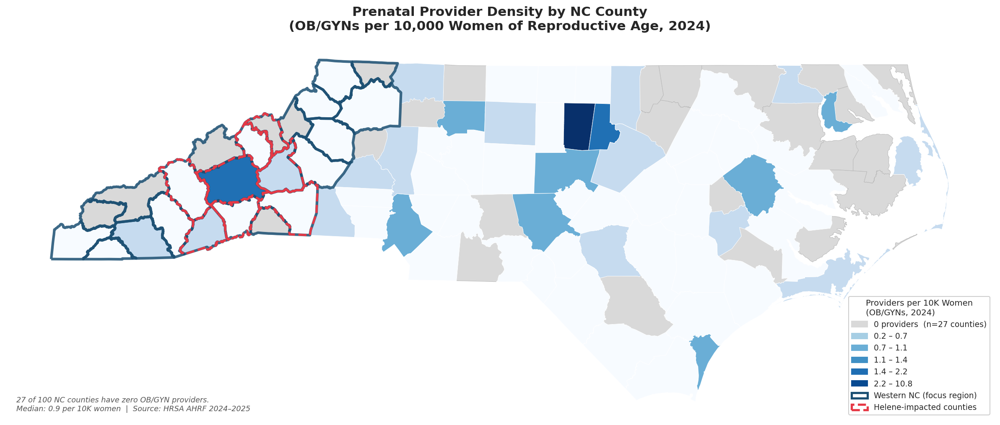
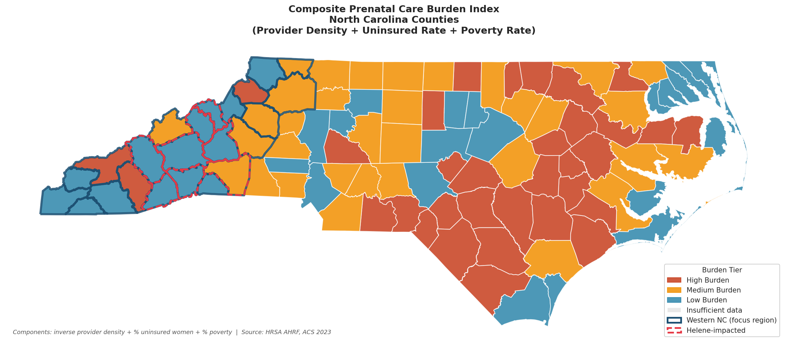

# NC Prenatal Care Access Analysis
### Mapping Maternal Health Deserts Across North Carolina's 100 Counties

**HRSA AHRF · Census ACS · HPSA · CDC WONDER · GeoPandas · Statsmodels**

A county-level analysis of prenatal care access gaps across North Carolina, with a focus on Western NC — a region whose pre-existing provider shortages were amplified by Hurricane Helene (September 2024). Integrates five federal data sources to build a composite burden index, identify zero-provider counties, and surface structural patterns that standard SDOH analyses miss.

---

## Key Findings

- **27 of 100 NC counties have zero OB/GYN providers** — statewide median is 0.9 per 10,000 women of reproductive age
- **96 of 100 counties carry active maternity care HPSA designations**, reflecting near-universal shortage status across the state
- **All 23 Western NC counties are suppressed in CDC WONDER** natality data — the federal surveillance system is blind to the region most at risk, a finding consistent with Runkle & Sugg (2025, *NC Medical Journal*)
- **WNC's crisis is not explained by standard SDOH**: Mann-Whitney U tests show no significant regional difference in provider density, poverty, or vehicle access — only insurance coverage (p<0.001) and broadband (p=0.03) differ, both in WNC's favor. Geographic isolation and infrastructure loss are the more likely drivers
- **Watauga County tops the composite burden index** (0.90/1.0), driven by high uninsured rates among a large student-age population and zero OB/GYN subspecialists

---

## Maps



*27 of 100 NC counties have zero OB/GYN providers (gray). Care is concentrated in a handful of urban counties while Western NC and the eastern coastal plain are largely underserved.*

<br/>



*Composite burden index combining inverse provider density, % uninsured women, and % poverty across all 100 counties. High-burden counties appear in both WNC and the eastern coastal plain — different geographies, similar structural gaps.*

---

## Data Sources

| Source | Variables | County Coverage |
|--------|-----------|-----------------|
| Census ACS 2023 (5-yr) | Insurance, poverty, vehicle access, broadband | 100/100 |
| HRSA AHRF 2024–2025 | OB/GYN provider counts (general + subspecialty) | 100/100 |
| HRSA HPSA Primary Care file | Maternity Care shortage scores (PC MCTA) | 96/100 |
| USDA Rural-Urban Continuum Codes 2023 | Rural classification (1–9 scale) | 100/100 |
| CDC WONDER Natality 2016–2024 | Prenatal care trimester initiation rates | 28/100 (suppression) |

---

## Methods

**Data pipeline:** Multi-source integration across Census API, HRSA, USDA, and CDC; county-level FIPS-keyed master dataset; automated downloads for all sources except CDC WONDER (manual export required due to anti-scraping policy)

**Provider density:** OB/GYN providers per 10,000 women of reproductive age (15–44); source is HRSA AHRF `tot_md_do_obgyn_gen_23` + `md_nf_obgyn_subsp_23`

**Regional comparison:** Mann-Whitney U (non-parametric) for Western NC vs. rest of state; 23 WNC counties defined by Appalachian Regional Commission designation

**Composite burden index:** MinMax-normalized equal-weight composite of inverse provider density, % uninsured women, and % poverty — built on all 100 counties to avoid CDC WONDER suppression excluding WNC entirely

**OLS regression:** Predictors of late/no prenatal care (28-county CDC WONDER subset); R²=0.436, F-stat p=0.025; interpret with caution given small n and high VIF on poverty/vehicle collinearity

---

## Visualizations

| Figure | Description |
|--------|-------------|
| `map_provider_density.png` | Choropleth — OB/GYNs per 10K women; zeros in gray, Blues scale for non-zero |
| `map_burden_index.png` | Composite burden tier map — High/Medium/Low burden across all 100 counties |
| `correlation_heatmap.png` | Spearman correlation matrix — SDOH and provider supply indicators |
| `regional_bar_charts.png` | WNC vs. Piedmont/Coastal mean comparisons across 5 variables |
| `provider_density_distribution.png` | Histogram + regional boxplot of provider density |
| `wnc_scatterplot.png` | Provider density vs. late/no prenatal care (28-county WONDER subset) |

---

## Contextual Note — Hurricane Helene

Eight WNC counties (Buncombe, Haywood, Henderson, McDowell, Mitchell, Rutherford, Transylvania, Yancey) experienced significant healthcare infrastructure disruption from Hurricane Helene in September 2024. This analysis treats Helene as amplifying pre-existing structural gaps rather than creating them. Per Runkle & Sugg (2025), 6 labor and delivery units closed in WNC between 2015 and 2024, and only half of local facilities offered prenatal/delivery care before the storm.

> Runkle, J. & Sugg, M. (2025). Rebuilding Maternal Health Access in Western North Carolina: Addressing Critical Gaps Amplified by Hurricane Helene. *NC Medical Journal, 86*(1), 8–11. https://doi.org/10.18043/001c.137497

---

## Repository Structure

```
nc-prenatal-care-access/
├── notebook/
│   └── NC_Prenatal_Care_Analysis_CLEAN.ipynb   # Full analysis notebook
├── data/
│   └── processed/                               # Merged county-level dataset
│       ├── master_county.csv                    # 100 counties × 32 variables
│       ├── burden_index.csv                     # Composite burden scores + tiers
│       └── wnc_county_profiles.csv              # Western NC deep dive table
├── outputs/
│   ├── figures/                                 # All 6 visualizations (PNG)
│   └── tables/                                  # Summary stats, regression, Mann-Whitney
└── README.md
```

> **Note on raw data:** Raw files from HRSA, USDA, and ACS are pulled automatically by the notebook at runtime. The CDC WONDER `.txt` file requires a manual export from https://wonder.cdc.gov/natality-current.html (see notebook Cell 5 for instructions).

---

## How to Run

```bash
git clone https://github.com/JohnApelJr/nc-prenatal-care-access.git
cd nc-prenatal-care-access
# Open notebook/NC_Prenatal_Care_Analysis_CLEAN.ipynb in Jupyter or Google Colab
# Run cells top-to-bottom — all data pulls automated except CDC WONDER (Cell 5)
```

**Requirements:** Python 3.10+, `geopandas`, `pygris`, `pandas`, `numpy`, `matplotlib`, `seaborn`, `scipy`, `statsmodels`, `scikit-learn`, `requests`

---

## Related Projects

- [nc-pediatric-access-pipeline](https://github.com/JohnApelJr/nc-pediatric-access-pipeline) — Pediatric specialist supply vs. child population demand across NC's 100 counties
- [chronic-disease-geospatial-pipeline](https://github.com/JohnApelJr/chronic-disease-geospatial-pipeline) — Chronic disease disparities across 2,956 U.S. counties

---

*M.S. Applied Data Science · Syracuse University · February 2026*  
*Contact: [johnapeljr@gmail.com](mailto:johnapeljr@gmail.com) · [Portfolio](https://johnapeljr.github.io)*
